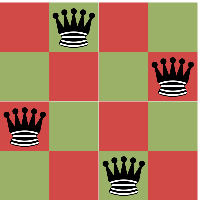
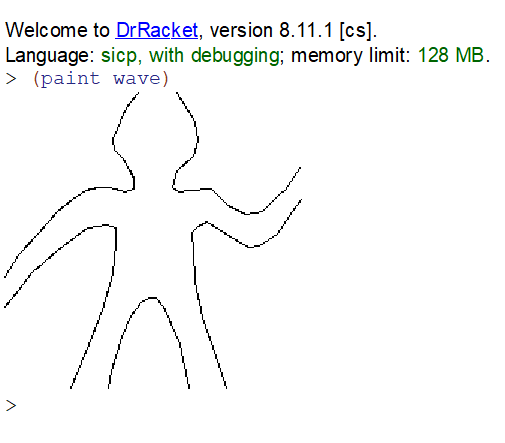
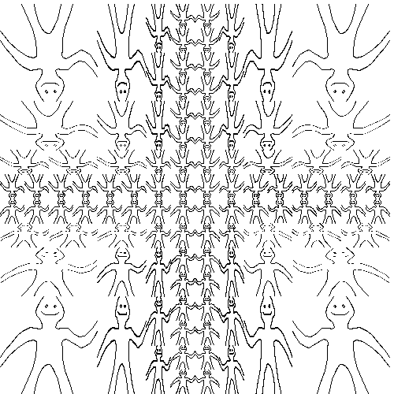
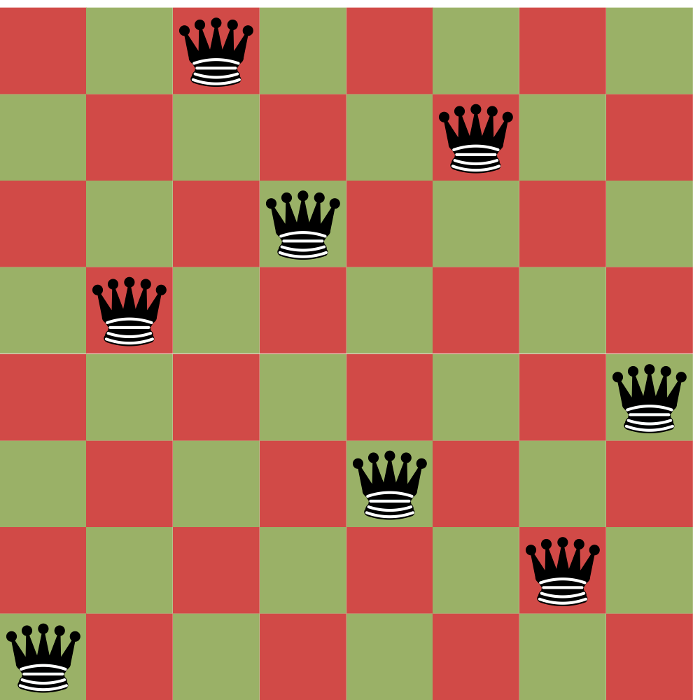

# 2.2.1 Representing Sequences
## 2.17

```racket
#lang sicp

(define (last-pair lst)
  (let ((tail (cdr lst)))
    (if (null? tail)
      lst
      (last-pair tail))))
```

## 2.18

```racket
#lang sicp

(define (reverse lst)
  (define (push-all source dest)
    (if (null? source)
      dest
      (push-all (cdr source) (cons (car source) dest))))
  (push-all lst nil))
```

## 2.19

```racket
#lang sicp

(define us-coins 
  (list 50 25 10 5 1))

(define uk-coins 
  (list 100 50 20 10 5 2 1 0.5))

(define no-more? null?)
(define except-first-denomination cdr)
(define first-denomination car)

(define (cc amount coin-values)
  (cond ((= amount 0) 
         1)
        ((or (< amount 0) 
             (no-more? coin-values)) 
         0)
        (else
         (+ (cc 
             amount
             (except-first-denomination 
              coin-values))
            (cc 
             (- amount
                (first-denomination 
                 coin-values))
             coin-values)))))
```

ну немного потестив, например ```(cc 100 (reverse us-coins))```, да и по смыслу, можно понять, что ничего менятся не должно

### Доказательство:

мат индукция (по размеру списка и по amount)

для ```amount <= 0``` утверждение автоматически выполнено
для пустого списка утверждение автоматически выполнено

рассмотрим (cc amount (a_1 a_2 ... a_n))

и докажем что любая перестановка a_i, a_j -> a_j, a_i
не меняет результата

действительно, пусть i, j >= 1,
иначе говоря в перестановке не участвует первый элемент

тогда мы знаем, что (без уменьшения общности)

```
(cc x (a_1 ... a_i ... a_j ... a_n)) = (cc (x - a_1) (a_1 ... a_i ... a_j ... a_n))
                                     + (cc x (a_2 ... a_i ... a_j ... a_n))
                                     = (cc (x - a_1) (a_1 ... a_j ... a_i ... a_n))
                                     + (cc x (a_2 ... a_j ... a_i ... a_n))
                                     = (cc x (a_1 ... a_j ... a_i ... a_n))
```

теперь мы доказали, что любая перестановка в хвосте даёт нам идентичные результаты
(потому что любая перестановка может быть выражена серией swap-ов)

остался только случай, когда в перестановке участвует первый элемент
используя предыдущий результат мы легко можем показать, что достаточно проверить перестановку первого со вторым элементом

```
(cc x (a b ...)) 
      = 
(cc x (b a ...))
```

ну действительно, давайте раскроем

```
(cc (x - a) (a b ...)) + (cc x (b ...))
                  = 
(cc (x - b) (b a ...)) + (cc x (a ...))
```

воспользуемся индукционным предположением 

```
(cc (x - a) (b a ...)) + (cc x (b ...))
                  = 
(cc (x - b) (a b ...)) + (cc x (a ...))
```

и еще раз раскроем

```
  (cc (x - a - b) (b a ...))        (cc (x - b - a) (a b ...)) 
+ (cc (x - a) (a ...))         =  + (cc (x - b) (b ...))
+ (cc (x - b) (b ...))            + (cc (x - a) (a ...))  
+ (cc x (...))                    + (cc x (...))
```

перегруппируем и воспользуемся индукционным предположением
и получим полностью идентичные выражения с обоих сторон:

```
  (cc (x - a - b) (b a ...))        (cc (x - a - b) (b a ...)) 
+ (cc (x - a) (a ...))         =  + (cc (x - a) (a ...))
+ (cc (x - b) (b ...))            + (cc (x - b) (b ...))  
+ (cc x (...))                    + (cc x (...))
```

а значит и в целом при любой перестановке выражение ```(cc x ...)``` не меняется

## 2.20

```racket
#lang sicp

(define (filter f lst)
  (if (null? lst)
    lst
    (let ((h (car lst))
          (t (cdr lst)))
      (if (f h) 
        (cons h (filter f t))
        (filter f t)))))

(define (same-parity a . b)
  (filter (lambda (x) (= (remainder x 2)
                         (remainder a 2)))
          (cons a b)))
```

## 2.21

```racket
#lang sicp

(define (square x) (* x x))

(define (square-list items)
  (if (null? items)
      nil
      (cons (square (car items)) 
            (cdr items))))

(define (square-list items)
  (map square items))
```

## 2.22

```racket
(define (square-list items)
  (define (iter things answer)
    (if (null? things)
        answer
        (iter (cdr things)
              (cons (square (car things))
                    answer))))
  (iter items nil))
```

ну давайте посмотрим на каком-то примере что происходит

```
(iter (1 2 3 4 5) ())
(iter (2 3 4 5) (1))
(iter (3 4 5) (4 1))
(iter (4 5) (9 4 1))
(iter (5) (16 9 4 1))
(iter () (25 16 9 4 1))
```

мы берем с начала первого списка и добавляем в начало второго
понятно, что подобный процесс развернет список

```racket
(define (square-list items)
  (define (iter things answer)
    (if (null? things)
        answer
        (iter (cdr things)
              (cons answer
                    (square 
                     (car things))))))
  (iter items nil))
```

изменение порядка cons тоже не поможет
потому что получится список-наоборот

где car == cdr, cdr == car

```((((((() 1) 4) 9) 16) 25))```

## 2.23

```racket
#lang sicp

(define (for-each action sequence)
  (if (not (null? sequence))
    (begin 
      (action (car sequence))
      (for-each action (cdr sequence)))))
```

# 2.2.2 Hierarchical Structures
## 2.24

```(1 (2 (3 4)))```

```
+---+---+   +---+---+ 
| | | --+-->| | | / |
+-+-+---+   +-+-+---+
  |           |      
  v           v       
+---+       +---+---+   +---+---+            
| 1 |       | | | --+-->| | | / |            
+---+       +-+-+---+   +-+-+---+             
              |           |                           
              v           v                           
            +---+       +---+---+   +---+---+                        
            | 2 |       | | | --+-->| | | / |                            
            +---+       +-+-+---+   +-+-+---+                          
                          |           |                                  
                          v           v                             
                        +---+       +---+                                
                        | 3 |       | 4 |       
                        +---+       +---+      
```

```
*-->*-->nil  
|   |      
v   v      
1   *-->*-->nil        
    |   |                  
    v   v                 
    2   *-->*-->      
        |   |  |  
        v   v  v  
        3   4  nil
```

## 2.25

```racket
#lang sicp
(car (cdr (car (cdr (cdr '(1 3 (5 7) 9))))))
(car (car '((7))))
(car (cdr (car (cdr (car (cdr (car (cdr (car (cdr (car (cdr '(1 (2 (3 (4 (5 (6 7))))))))))))))))))
```

## 2.26

```
(1 2 3 4 5 6)
((1 2 3) 4 5 6)
((1 2 3) (4 5 6))
```

## 2.27

```racket
#lang sicp

(define (deep-reverse lst)
  (define (push-all source dest)
    (if (null? source)
      dest
      (push-all (cdr source) (cons (deep-reverse (car source)) dest))))
  (if (list? lst)
      (push-all lst nil)
      lst))
```

## 2.28

```racket
#lang sicp

(define (fringe tree)
  (define (leaf? x)
    (not (list? x)))
  (define (merge tree lst)
    (cond ((null? tree) lst)
          ((leaf? tree) (cons tree lst))
          (else (merge (car tree)
                       (merge (cdr tree) lst)))))
  (merge tree nil))
```

## 2.29

много пунктов, поэтому давайте по-порядку

```racket
#lang sicp

(define (make-mobile left right)
  (list left right))

(define (make-branch length structure)
  (list length structure))
```

сначала нас попросили сделать селекторы
это достаточно тривиально: просто алиасы 

```racket
(define left-branch car)
(define right-branch cadr)

(define branch-length car)
(define branch-structure cadr)
```

дальше нас просят сделать total-weight
и для этого мы сделаем дополнительно branch-weight

```racket
(define (branch-weight branch)
  (define mobile? pair?)
  (let ((structure (branch-structure branch)))
    (if (mobile? structure)
      (total-weight structure)
      structure)))

(define (total-weight mobile)
  (+ (branch-weight (left-branch mobile)) 
     (branch-weight (right-branch mobile))))
```

в финале мы бы могли тривиально 
переиспользовать branch-weight и total-weight,
однако проблема в том, что это будет O(n^2)

поэтому придётся написать гораздо более ugly штуку
которую можно было бы избежать чисто в теории, если бы у нас был tree map-reduce

```racket
(define (balanced? mobile)
  (define (on-branch branch)
    (with-weight (branch-structure branch)))
  (define (with-weight mobile)
    (define (combine-results left right)
      (let ((l-balanced (car left))
            (l-weight (cdr left))
            (l-length (branch-length (left-branch mobile)))
            (r-balanced (car right))
            (r-weight (cdr right))
            (r-length (branch-length (right-branch mobile))))
        (cons (and l-balanced r-balanced
                 (= (* l-weight l-length)
                    (* r-weight r-length)))
              (+ l-weight r-weight))))
    (if (not (pair? mobile))
      (cons true mobile)
      (combine-results (on-branch (left-branch mobile))
                       (on-branch (right-branch mobile)))))
  (car (with-weight mobile)))
```

в финале нам предлагают поменять код 
с учётом новых определений конструкторов

```racket
(define (make-mobile left right)
  (cons left right))

(define (make-branch length structure)
  (cons length structure))
```

и это достаточно просто (нам надо сделать изменения только в двух местах):

```racket
(define left-branch car)
(define right-branch cdr)

(define branch-length car)
(define branch-structure cdr)
```

## 2.30

```racket
#lang sicp

(define (square x) (* x x))

(define (square-tree tree)
  (cond ((null? tree) nil)
        ((not (pair? tree)) 
         (square tree))
        (else
         (cons (square-tree (car tree))
               (square-tree (cdr tree))))))

(define (fork p f g)
  (lambda (x)
    (if (p x)
      (f x)
      (g x))))

(define (square-tmap tree)
  (map (fork pair? square-tmap square) tree))
```

единственное изменение которое я внёс, по сути - fork

## 2.31

```racket
#lang sicp

(define (fork p f g)
  (lambda (x) (if (p x) (f x) (g x))))

(define (tree-map f tree)
  (define (tree-map* tree)
    (tree-map f tree))
  (map (fork list? tree-map* f) tree))
```

ну опять же, пишем отдельно fork,
потому что так чуточку понятней, что происходит

## 2.32

```racket
#lang sicp

(define (subsets s)
  (if (null? s)
      (list nil)
      (let ((rest (subsets (cdr s)))
            (cons-first (lambda (lst) 
                          (cons (car s) lst))))
        (append rest (map cons-first rest)))))
```

ну почему это работает?

потому что множество всех подмножеств может быть разделено на два класса:
подмножества в которые включен первый элемент x и все остальные

причём можно заметить, что отличаются эти два класса лишь исключительно тем
что в одном из них есть x, а в другом нет

поэтому алгоритм генерации прост:

1. сгенерируй 2 подмножества всех подмножеств, которые не содержат x
2. в одном из них к каждому множеству дорисуй элемент x
3. объедини два множества подмножеств

и это буквально то, что мы делаем

# 2.2.3 Sequences as Conventional Interfaces
## 2.33

```racket
#lang sicp

(define (accumulate op initial sequence)
  (if (null? sequence)
      initial
      (op (car sequence)
          (accumulate op 
                      initial 
                      (cdr sequence)))))

(define (map p sequence)
  (accumulate (lambda (x y) (cons (p x) y)) 
              nil sequence))

(define (append seq1 seq2)
  (accumulate cons seq2 seq1))

(define (length sequence)
  (accumulate (lambda (x y) (+ 1 y)) 0 sequence))
```

ну действительно, если рассмотреть результат применения map:

```
(cons (p a_0) (cons (p a_1) (cons (p a_2) ... (cons (p a_n) nil) ... )))
```

то можно заметить, что оно весьма похоже например на сумму всех элементов списка

```
(+ a_0 (+ a_1 (+ a_2 ... (+ a_n 0) ... )))
```

просто заместо операции ```(+ x y)``` и стартового 0, 
используется операция ```(cons (p x) y)``` и стартовый nil

аналогично с append, length

```
(cons a_0 (cons a_1 ... (cons a_n seq-2) ... ))
```

```
(+ 1 (+ 1 ... (+ 1 0) ... ))
```

## 2.34

```racket
#lang sicp

(define (accumulate op initial sequence)
  (if (null? sequence)
      initial
      (op (car sequence)
          (accumulate op 
                      initial 
                      (cdr sequence)))))

(define (horner-eval x coefficient-sequence)
  (accumulate 
    (lambda (this-coeff higher-terms)
      (+ this-coeff (* x higher-terms)))
    0
    coefficient-sequence))
```

ну опять же, ничего сверхъестественного
как вычислить многочлен? ```a_0 + a_1 * x + a_2 * x^2 ... + a_n * x^n```

ну очень просто ```a_0 + x * (a_1 + a_2 * x^1 + ... + a_n * x^(n - 1))```

иными словами ```(eval-at x poly) = (+ (car poly) (* x (eval-at x (cdr poly))))``` 
ну а это наш старый добрый знакомый — accumulate

## 2.35

```racket
#lang sicp

(define (accumulate op initial sequence)
  (if (null? sequence)
      initial
      (op (car sequence)
          (accumulate op 
                      initial 
                      (cdr sequence)))))

(define (->1 x) 1)

(define (fork p f g)
  (lambda (x) (if (p x) (f x) (g x))))

(define (count-leaves t)
  (accumulate + 0 (map (fork list? count-leaves ->1) t)))
```

схема такая: посчитаем размер поддеревьев и проссуммируем результаты
если поддерево не лист, то мы можем запустить ```count-leaves```
если же это лист, то мы должны превратить его в 1 

поэтому нам поможет 2 вспомогательные функции: ```->1```, ```fork```
про ```fork``` мы уже знаем, а ```->1``` это то, что любой объект замещает единицей

ну опять нам поможет старый добрый ```fork```

## 2.36

```racket
#lang sicp

(define (accumulate op initial sequence)
  (if (null? sequence)
      initial
      (op (car sequence)
          (accumulate op 
                      initial 
                      (cdr sequence)))))

(define (accumulate-n op init seqs)
  (if (null? (car seqs))
      nil
      (cons (accumulate op init (map car seqs))
            (accumulate-n op init (map cdr seqs)))))
```

ну примерно такая же история, чтобы сделать accumulate от первых элементов
надо просто сделать ```map car```

более интересная байда заключается в том,
что через ```accumulate-n``` можно сделать многим знакомый ```zip```

или, более подходящее имя, если контекст происходящего — матрицы: ```transpose```

```racket
(define (zip seqs)
  (accumulate-n cons nil seqs))
```

однако имея на руках ```zip```, можно выразить ```accumulate-n```

```racket
(define (accumulate-n op init seqs)
  (define (accumulate* seq)
    (accumulate op init seq))
  (map accumulate* (zip seqs)))
```

ну в общем такие дела

## 2.37

```racket
#lang sicp

(define (accumulate op initial sequence)
  (if (null? sequence)
      initial
      (op (car sequence)
          (accumulate op 
                      initial 
                      (cdr sequence)))))

(define (accumulate-n op init seqs)
  (if (null? (car seqs))
      nil
      (cons (accumulate op init (map car seqs))
            (accumulate-n op init (map cdr seqs)))))

(define (dot-product v w)
  (accumulate + 0 (map * v w)))

(define (matrix-*-vector m v)
  (map (lambda (row) (dot-product row v)) m))

(define (transpose mat)
  (accumulate-n cons nil mat))

(define (matrix-*-matrix m n)
  (let ((cols (transpose n)))
    (map (lambda (row)
           (matrix-*-vector cols row))
         m)))
```

давайте по-порядку:

1. ```matrix-*-vector``` — это вектор состоящий из скалярного произведения строк матрицы и вектора
2. ```transpose``` мы уже обсуждали в прошлый раз, под именем ```zip```, но, да, достаточно создать список из первых элементов списков, список из вторых элементов списков и т.д. 
   этим у нас почти-что занимается ```accumulate-n```, за исключением того, что нам надо положить такую функцию в ```accumulate```, что она сохранит списко, и как мы знаем это — ```(accumulate cons nil x)```
3. ```matrix-*-matrix``` — итак, мы уже умеем умножать матрицы на вектора, а что такое умножение матриц? 

каждый i, j (i-ая строка, j-ый столбец) элемент результата — это скалярное произведение строки на соответствующий столбец
если мы возьмём целиком i строку, то это будет строка скалярных произведений строки на все столбцы
но это в свою очередь не более чем матричное умножение матрицы стобцов на строку как вектор

поэтому итоговую вещь можно представить как матричное умножение матрицы столбцов на строку (интерпретированную как вектор), по всем строкам

чтобы проверить, давайте что-нибудь посчитаем

```
> (matrix-*-matrix '((1 2 3) (4 5 6)) '((7 8) (9 10) (11 12)))
((58 64) (139 154))
```

## 2.38

забиваем всё в интерпретатор и получаем

```
1 1/2
1/6
(1 (2 (3 ())))
(((() 1) 2) 3)
```

ну допустим операция такая, что для любого с и для любого seq 
```(fold-left op c seq)``` == ```(fold-right op c seq)```

заметим следующее:

```
(fold-right op c (list a b)) = (op a (op b c))
(fold-left op c (list a b)) = (op (op a b) c)
```

иначе говоря для любых трёх элементов a, b, c операция op такова, что:

```
(op a (op b c)) == (op (op a b) c)
```

что более известно как ассоциативность
а из неё следует кстати, что любая расстановка скобок будет давать один и тот же результат

[proof](https://planetmath.org/proofofgeneralassociativity)

## 2.39

```racket
#lang sicp

(define (fold-right op initial sequence)
  (if (null? sequence)
      initial
      (op (car sequence)
          (fold-right op 
                      initial 
                      (cdr sequence)))))

(define (fold-left op initial sequence)
  (define (iter result rest)
    (if (null? rest)
        result
        (iter (op result (car rest))
              (cdr rest))))
  (iter initial sequence))

(define (reverse-right sequence)
  (fold-right 
   (lambda (x y) (append y (list x))) nil sequence))

(define (reverse-left sequence)
  (fold-left 
   (lambda (x y) (cons x y)) nil sequence))
```

ну... ```reverse-right``` должен каким-то образом поместить первый элемент ко всем предыдущим
которые уже отреверсили ```(op a_0 reversed)```, ну это например ```(append reversed (list a_0))```, что не очень эффективно

второе гораздо проще, надо к уже ```(reversed a_1 a_2 ... a_n-1)``` добавить ```a_n```, ну это просто ```(cons a_n reversed)```

## 2.40

```racket
#lang sicp

(define (accumulate op initial sequence)
  (if (null? sequence)
      initial
      (op (car sequence)
          (accumulate op 
                      initial 
                      (cdr sequence)))))

(define (filter p seq)
  (accumulate 
    (lambda (x y)          
       (if (p x)             
         (cons x y)         
         y))                 
     nil                      
     seq))         

(define (flatmap proc seq)
  (accumulate append nil (map proc seq)))

(define (enumerate-interval low high)
  (if (> low high)
      nil
      (cons low (enumerate-interval (inc low) high))))

(define (unique-pairs n)
  (flatmap                                      
   (lambda (i)                                  
     (map (lambda (j)                           
            (list i j))                         
          (enumerate-interval 1 (dec i))))      
   (enumerate-interval 1 n)))

(define (prime-sum? pair)
  (prime? (+ (car pair) (cadr pair))))

(define (prime? x)
  (define (iter i)
    (if (<= (* i i) x)
      (if (zero? (remainder x i))
        #false
        (iter (inc i)))
      #true))
  (if (> x 1)
    (iter 2)
    #false))

(define (make-pair-sum pair)
  (list (car pair) 
        (cadr pair) 
        (+ (car pair) (cadr pair))))

(define (prime-sum-pairs n)
  (map make-pair-sum
       (filter 
        prime-sum?
        (unique-pairs n))))
```

выносим просто код... и всё

## 2.41

```racket
#lang sicp

(define (accumulate op initial sequence)
  (if (null? sequence)
      initial
      (op (car sequence)
          (accumulate op 
                      initial 
                      (cdr sequence)))))

(define (filter p seq)
  (accumulate 
    (lambda (x y)          
       (if (p x)             
         (cons x y)         
         y))                 
     nil                      
     seq))         

(define (flatmap proc seq)
  (accumulate append nil (map proc seq)))

(define (enumerate-interval low high)
  (if (> low high)
      nil
      (cons low (enumerate-interval (inc low) high))))

(define (permutations s)
  (if (null? s)   ; empty set?
      (list nil)  ; sequence containing empty set
      (flatmap (lambda (x)
                 (map (lambda (p) 
                        (cons x p))
                      (permutations 
                       (remove x s))))
               s)))

(define (remove item sequence)
  (filter (lambda (x) (not (= x item)))
          sequence))

(define (sums-to k start s)
  (if (= k 1)         
    (if (<= start s) 
      (list (list s)) nil)
    (flatmap
      (lambda (i)                                  
        (map (lambda (p) (cons i p))               
             (sums-to (dec k) (inc i) (- s i))))  
      (enumerate-interval start s))))

(define (unordered-triples s)
  (sums-to 3 1 s))

(define (ordered-triples s)
  (flatmap permutations (unordered-triples s)))
```

ну? каким образом к этому заданию можно подойти:

давайте сначала сгенерируем множества (отсортированные тройки сумма которых равна s)
а потом просто сделаем ```(flatmap permutations unordered)```

собственно сделать отсортированные тройки, проблема не сказать, что большая

другой вариант наверное выглядел бы как-нибудь:

1. давайте нагенерируем всевозможные тройки
2. отфильтруем по сумме
3. отфильтруем по одинаковости

```racket
(define (product seq . rst)
  (if (null? rst)
    (map list seq)
    (let ((prod-rst (apply product rst)))
      (flatmap (lambda (i) 
                 (map (lambda (p)
                        (cons i p)) prod-rst))
               seq))))

(define (triples s)
  (filter (lambda (triple)
            (let ((a (car triple))
                  (b (cadr triple))
                  (c (cdar triple)))
              (and (not (= a b)) 
                   (not (= b c))
                   (not (= a c))
                   (= (+ a b c) s))))
          (product (enumerate-interval 1 s)
                   (enumerate-interval 1 s)
                   (enumerate-interval 1 s))))
```

## 2.42

```racket
#lang sicp

(define (accumulate op initial sequence)
  (if (null? sequence)
      initial
      (op (car sequence)
          (accumulate op 
                      initial 
                      (cdr sequence)))))

(define (filter p seq)
  (accumulate 
    (lambda (x y)          
       (if (p x)             
         (cons x y)         
         y))                 
     nil                      
     seq))         

(define (flatmap proc seq)
  (accumulate append nil (map proc seq)))

(define (enumerate-interval low high)
  (if (> low high)
      nil
      (cons low (enumerate-interval (inc low) high))))

(define (queens board-size)
  (define (queen-cols k)
    (if (= k 0)
        (list empty-board)
        (filter
         (lambda (positions) 
           (safe? k positions))
         (flatmap
          (lambda (rest-of-queens)
            (map (lambda (new-row)
                   (adjoin-position new-row k rest-of-queens))
                 (enumerate-interval 1 board-size)))
          (queen-cols (- k 1))))))
  (queen-cols board-size))

(define empty-board nil)

(define (adjoin-position row col positions)
  (cons row positions))

(define (safe? k positions)
  (define (check-move step t positions)
    (or (null? positions)
      (let ((head (car positions))
            (tail (cdr positions))
            (next (+ t step)))
        (and (not (= next head))
             (check-move step next tail)))))
  (or (null? positions)
    (let ((head (car positions))
          (tail (cdr positions)))
      (and (check-move  1 head tail)
           (check-move  0 head tail)
           (check-move -1 head tail)))))

(define (display-row size)
  (lambda (i)
    (for-each 
      (lambda (j)
        (display (if (= i j) "Q" "#")))
      (enumerate-interval 1 size))
    (newline))) 

(define (display-queens positions)
  (for-each (display-row (length positions)) positions)
  (newline))
```

ну, будем хранить позиции перевернуто в списке
для пустой доски есть единственная расстановка -- пустая, то есть empty-board == nil

колонки проверять не надо, они гарантированно не пересекаются
поэтому проверяем только строки, для этого идём назад по списку и смотрим не совпала ли позиция по двум диагоналям или по прямой 

```
> (for-each display-queens (queens 4))
##Q#
Q###
###Q
#Q##

#Q##
###Q
Q###
##Q#
```

 


## 2.43

итак, Льюис предлагает следующий код, и почему-то он работает медленно:

```racket
(flatmap
 (lambda (new-row)
   (map (lambda (rest-of-queens)
          (adjoin-position 
           new-row k rest-of-queens))
        (queen-cols (- k 1))))
 (enumerate-interval 1 board-size))
```

в общем, в чём тут беда?
в том, что queen-cols достаточно затратная процедура, а мы её каждый раз теперь вызываем

### Общий временной анализ

ну давайте как-нибудь что-нибудь оценим:
алгоритм из 2.42 работает примерно следующим образом

```
T_1(k) ≈ T_1(k - 1) + N * S(k - 1)
```

где ```T_1(k)``` - время работы ```queen-cols```
```S(k)``` — количество подходящих решений
```N``` — размер доски

измененный алгоритм работает иначе:

```
T_2(k) ≈ N * (S(k - 1) + T_2(k - 1))
```

если раскрыть последовательности, получится что-то вроде:

```
T_1(N) ≈ N * (S(1) + S(2) + ... + S(N - 1))
T_2(N) ≈ S(1) * N^(N - 1) + S(2) * N^(N - 2) + ... + S(N - 1) * N
```

поэтому если ```T_1(N) = T```, то 

```
T_2(N) ≈ T + (S(1) * N^(N - 2) + S(2) * N^(N - 3) + ... + S(N - 1)) 
       >= T + N^(N - 2)
```

ну в общем какое-то значительное число действий делаем лишнее
каков порядок ```S(i)```, мне не известно, так прямо и не скажешь 

чем он далее от грубой оценки сверху ```N^i```, 
тем хуже оценка ```T_2(N)```

при самых оптимистичных оценках, получаем, что разница как минимум в 2 раза
а наверняка что-то экспоненциальное

### Анализ при N = 8

однако если говорить про конкретный случай N = 8, то factor можно даже попробовать посчитать
давайте это сделаем и проверим на практике, каков он в действительности

для этого сначала перепишем немного наш код, чтобы можно было легко добыть ```S(i)```,
ведь от их величины всё зависит

```racket
(define (queen-cols board-size)
  (define (queen-cols* k)
    (if (= k 0)
        (list empty-board)
        (filter
         (lambda (positions) 
           (safe? k positions))
         (flatmap
          (lambda (rest-of-queens)
            (map (lambda (new-row)
                   (adjoin-position new-row k rest-of-queens))
                 (enumerate-interval 1 board-size)))
          (queen-cols* (- k 1))))))
  queen-cols*)

(define (queens board-size)
  ((queen-cols board-size) board-size))

(define (queens-slow board-size)
  (define (queen-cols k)
    (if (= k 0)
        (list empty-board)
        (filter
         (lambda (positions) 
           (safe? k positions))
         (flatmap
          (lambda (new-row)
            (map (lambda (rest-of-queens)
                   (adjoin-position new-row k rest-of-queens))
                 (queen-cols (- k 1))))
          (enumerate-interval 1 board-size)))))
  (queen-cols board-size))
```

теперь мы можем попробовать посчитать ratio на основе формул выше

```racket
(define (ratio N)
  (let ((S (sizes N)))
    (exact->inexact
     (/ (accumulate (lambda (x y) (* N (+ x y))) 0 (reverse S))
        (* N (apply + S))))))
```

```
> (ratio 6)
92.62162162162163
> (ratio 7)
438.06066536203525
> (ratio 8)
2171.0997963340124
```

однако не ясно, насколько это всё отражает действительность
ну давайте посмотрим

для этого напишем вспомогательные profiling процедурки:

```racket
(define (timed-fn f args)
  (let ((start (runtime)))
    (apply f args)
    (- (runtime) start)))

(define (actual-ratio board-size)
  (let ((fast (timed-fn queens (list board-size)))
        (slow (timed-fn queens-slow (list board-size))))
    (exact->inexact (/ slow
                       fast))))

(define (actual-ratio-mean board-size experiments)
  (/ (apply + (map (lambda (i) (actual-ratio board-size))
                   (enumerate-interval 1 experiments)))
     experiments))

(define (timed-queens board-size experiments)
  (display "Timed-queens (") (display board-size) (display ")") (newline)
  (display "Expected ratio: ") (display (ratio board-size)) (newline)
  (display "Actual ratio: ") (display (actual-ratio-mean board-size experiments)) (newline))
```

и потестим некоторые значения, с experiments = 10

```
> (timed-queens 5 10)
Timed-queens (5)
Expected ratio: 23.41860465116279
Actual ratio: 40.43918836384485
```

```
> (timed-queens 6 10)
Timed-queens (6)
Expected ratio: 92.62162162162163
Actual ratio: 118.8953271865691
```

```
> (timed-queens 7 10)
Timed-queens (7)
Expected ratio: 438.06066536203525
Actual ratio: 524.523441239485
```

можно заметить, что результаты весьма accurate
ну и подождав минут 10, получим и результат для 8:

```
> (timed-queens 8 10)
Timed-queens (8)
Expected ratio: 2171.0997963340124
Actual ratio: 2316.2329688941963
```

в общем, порядок 2000T

# 2.2.4 Example: A Picture Language
## 2.44

```racket
#lang sicp

(#%require sicp-pict)

(define (up-split painter n)
  (if (= n 0)
      painter
      (let ((smaller (up-split painter 
                                  (- n 1))))
        (below painter 
                (beside smaller smaller)))))
```

## 2.45

```racket
#lang sicp

(define make-vect cons)
(define xcor-vect car)
(define ycor-vect cdr)

(define (f-coord f coord)
  (lambda (v . vs)
    (apply f (map coord (cons v vs)))))

(define (vect* t)
  (lambda (v . rst)
    (define (t-coord coord)           
      (apply (f-coord t coord) (cons v rst)))
    (make-vect (t-coord xcor-vect) 
               (t-coord ycor-vect))))

(define add-vect (vect* +))
(define sub-vect (vect* -))

(define (scale-vect s v)
  (define (*s x) (* s x))
  (make-vect ((f-coord *s xcor-vect) v)
             ((f-coord *s ycor-vect) v)))
```

ну ничего необычного
сделаем процедурку, которая будет применять некоторую функцию к списку координат (как если бы их подставили в неё)

сделаем функцию-темплейт, чтобы задать add-vect, sub-vect

и отдельно опишем scale-vect, потому что она с двумя предыдущими не имеет много общего

## 2.47

```racket
#lang sicp

(define (make-frame origin edge1 edge2)
  (list origin edge1 edge2))

(define origin-frame car)
(define edge1-frame cadr
(define edge2-frame caddr)

(define (make-frame* origin edge1 edge2)
  (cons origin (cons edge1 edge2)))

(define origin-frame* car)
(define edge1-frame* cadr
(define edge2-frame* cddr)
```

## 2.48

```racket
#lang sicp

(define make-segment cons)
(define start-segment car)
(define end-segment cdr)
```

## 2.49

```racket
#lang sicp
(#%require sicp-pict)
(#%require racket/base)

(define outline
  (segments->painter
   (vects->segments
    (list (make-vect 0 0)
          (make-vect 1 0)
          (make-vect 1 1)
          (make-vect 0 1)
          (make-vect 0 0)))))

(define cross
  (segments->painter
   (list
    (make-segment (make-vect 0 0) (make-vect 1 1))
    (make-segment (make-vect 1 0) (make-vect 0 1)))))

(define diamond
  (segments->painter
   (vects->segments
    (list (make-vect 0.5 0.0)
          (make-vect 1.0 0.5)
          (make-vect 0.5 1.0)
          (make-vect 0.0 0.5)
          (make-vect 0.5 0.0)))))

(define (accumulate op init values)
  (if (null? values)
      init
      (op (car values)
          (accumulate op init (cdr values)))))

(define (flatmap f lst)
  (accumulate append nil (map f lst)))

(define (dedup vs)
    (define (add h vs)
      (if (null? vs)
          (cons h nil)
          (if (equal? h (car vs))
              vs
              (cons h vs))))
    (if (null? vs)
        nil
        (add (car vs)
             (dedup (cdr vs)))))

(define wave-coords 
  '[({25.00 99.75} {28.50 89.12} 
     {33.00 76.12} {35.50 63.88}
     {36.12 53.38} {36.50 47.00}
     {34.62 45.00} {31.50 43.88}
     {27.38 46.25} {21.88 49.88}
     {17.50 52.38} {14.12 51.88}
     {07.75 47.88} {02.75 40.38}
     {00.00 36.00}              )
    ({64.75 99.88} {63.88 94.12} 
     {60.50 82.75} {57.25 75.38}
     {54.00 71.12} {51.50 69.50}
     {48.62 69.38} {46.00 72.62}
     {43.50 77.88} {40.62 84.88}
     {37.75 99.99}              )
    ({99.62 72.25} {95.38 67.00}
     {90.62 61.00} {81.88 53.12}
     {72.12 45.88} {65.62 44.75}
     {62.62 45.88} {62.38 51.00}
     {63.38 61.25} {66.75 73.38}
     {71.25 84.88} {77.75 99.75})
    ({55.00 00.12} {57.62 03.62}
     {60.00 07.50} {62.12 12.25}
     {63.38 15.88} {62.75 19.50}
     {59.88 22.38} {57.62 25.88}
     {56.50 29.25} {56.50 32.38}
     {59.50 33.38} {64.25 32.25}
     {68.50 32.12} {72.38 33.12}
     {77.00 35.88} {81.88 40.00}
     {88.62 47.62} {95.00 55.00}
     {99.75 62.38}              )
    ({00.50 25.62} {05.25 32.88}
     {06.62 34.12} {13.00 40.25}
     {18.62 41.25} {24.25 38.38}
     {30.25 32.62} {37.50 32.88}
     {41.00 33.62} {43.12 32.00}
     {41.50 26.50} {36.12 21.62}
     {34.38 16.62} {35.75 10.00}
     {41.88 00.38}              )])

(define (wave-coord->vector coord)
  (let ((v (apply make-vect coord)))
    (vector-sub (make-vect 1 1)
                (vector-scale 0.01 v))))

(define wave
  (segments->painter
      (flatmap vects->segments
        (map (lambda (coords) 
               (map wave-coord->vector coords))
             wave-coords))))
```

наверное вас интересует зачем тут ```(#%require racket/base)```
ну рассказываю: оказывается ```list``` в ```#lang sicp```
это совсем не тот ```list```, который определен в языке ```racket```

из-за чего, когда я пользуюсь ```(flatmap vects->segments ...)```, я получаю совершенно внезапный ```contract violation```

это всё потому, что ```sicp-pict``` написан на языке racket
из-за чего возникает сыр бор

как это правильно исправить я не додумался, надо изучать racket

но в общем, когда мы делаем ```(#%require racket/base)```, 
то часть определений из racket ```cons``` ```append``` и т.д.
как я понимаю перезаписывает таковые определенные в ```#lang sicp```

ну в общем это некоторое недоразумение, которое вроде как ничего не ломает в нашем примере, ну и чёрт с ним

наверное вас больше интересует как я человечка сделал?
ну я взял GIMP картинку 100 x 100 pp нарисовал контур линиями и сделать export в SVG

не знаю как он отрендериться:


SVG оказывается вполне себе XML-ный, текстовый, читаемый формат
потому я в VIM с помощью табличного редактирования обработал таблицы задающие контуры

и спомощью ```dedup``` убрал повторяющиеся элементы (у меня нет времени изучать откуда они в SVG, но походу несут какую-то роль)

и всё получилось 



## 2.50

```racket
#lang sicp
(#%require sicp-pict)
(#%require racket/base)

(define (transform-painter 
         painter origin corner1 corner2)
  (lambda (frame)
    (let ((m (frame-coord-map frame)))
      (let ((new-origin (m origin)))
        (painter (make-frame new-origin
                  (vector-sub (m corner1) 
                              new-origin)
                  (vector-sub (m corner2)
                              new-origin)))))))
(define (flip-horiz p)
  (transform-painter p (make-vect 1.0 0.0)
                       (make-vect 0.0 0.0)
                       (make-vect 1.0 1.0)))

(define (rotate180 p)
  (transform-painter p (make-vect 1.0 1.0)
                       (make-vect 0.0 1.0)
                       (make-vect 1.0 0.0)))

(define (rotate270 p)
  (transform-painter p (make-vect 0.0 1.0)
                       (make-vect 1.0 1.0)
                       (make-vect 0.0 0.0)))
```

## 2.51

### На прямую:

```racket
#lang sicp
(#%require sicp-pict)
(#%require racket/base)

(define (transform-painter 
         painter origin corner1 corner2)
  (lambda (frame)
    (let ((m (frame-coord-map frame)))
      (let ((new-origin (m origin)))
        (painter (make-frame new-origin
                  (vector-sub (m corner1) 
                              new-origin)
                  (vector-sub (m corner2)
                              new-origin)))))))

(define (below p1 p2)
  (let ((upper (transform-painter p1 (make-vect 0.0 0.5)
                                     (make-vect 1.0 0.5)
                                     (make-vect 0.0 1.0)))
        (lower (transform-painter p2 (make-vect 0.0 0.0)
                                     (make-vect 1.0 0.0)
                                     (make-vect 0.0 0.5))))
    (lambda (frame)
      (upper frame)
      (lower frame))))
```

### С помощью beside + вращений

ну вообще что такое below?
давайте мысленно повернем на 90 градусов по часовой стрелке
и получим, что это beside с поворотом картинок на 90 градусов по часовой стрелки

поэтому следующий код даст эквивалентное поведение коду "напрямую"

```racket
#lang sicp
(#%require sicp-pict)
(#%require racket/base)

(define (below p1 p2)
  (rotate90 (beside (rotate270 p1)
                    (rotate270 p2))))
```

## 2.52

```racket
#lang sicp
(#%require sicp-pict)
(#%require racket/base)

(define (accumulate op init values)
  (if (null? values)
      init
      (op (car values)
          (accumulate op init (cdr values)))))

(define (flatmap f lst)
  (accumulate append nil (map f lst)))

(define (dedup vs)
    (define (add h vs)
      (if (null? vs)
          (cons h nil)
          (if (equal? h (car vs))
              vs
              (cons h vs))))
    (if (null? vs)
        nil
        (add (car vs)
             (dedup (cdr vs)))))

(define wave-coords 
  '[({25.00 99.75} {28.50 89.12} 
     {33.00 76.12} {35.50 63.88}
     {36.12 53.38} {36.50 47.00}
     {34.62 45.00} {31.50 43.88}
     {27.38 46.25} {21.88 49.88}
     {17.50 52.38} {14.12 51.88}
     {07.75 47.88} {02.75 40.38}
     {00.00 36.00}              )
    ({64.75 99.88} {63.88 94.12} 
     {60.50 82.75} {57.25 75.38}
     {54.00 71.12} {51.50 69.50}
     {48.62 69.38} {46.00 72.62}
     {43.50 77.88} {40.62 84.88}
     {37.75 99.99}              )
    ({99.62 72.25} {95.38 67.00}
     {90.62 61.00} {81.88 53.12}
     {72.12 45.88} {65.62 44.75}
     {62.62 45.88} {62.38 51.00}
     {63.38 61.25} {66.75 73.38}
     {71.25 84.88} {77.75 99.75})
    ({55.00 00.12} {57.62 03.62}
     {60.00 07.50} {62.12 12.25}
     {63.38 15.88} {62.75 19.50}
     {59.88 22.38} {57.62 25.88}
     {56.50 29.25} {56.50 32.38}
     {59.50 33.38} {64.25 32.25}
     {68.50 32.12} {72.38 33.12}
     {77.00 35.88} {81.88 40.00}
     {88.62 47.62} {95.00 55.00}
     {99.75 62.38}              )
    ({00.50 25.62} {05.25 32.88}
     {06.62 34.12} {13.00 40.25}
     {18.62 41.25} {24.25 38.38}
     {30.25 32.62} {37.50 32.88}
     {41.00 33.62} {43.12 32.00}
     {41.50 26.50} {36.12 21.62}
     {34.38 16.62} {35.75 10.00}
     {41.88 00.38}              )])

(define smile
  '[({43.30 08.91} {42.18 10.29} 
     {43.80 11.66} {45.02 10.25} 
     {43.30 08.91}              )
    ({39.83 16.65} {41.41 17.97} 
     {44.78 18.70} {49.19 18.66} 
     {53.61 18.61} {56.25 17.41} 
     {57.59 15.88}              )
    ({52.03 08.59} {50.91 09.97} 
     {52.53 11.34} {53.75 09.94} 
     {52.03 08.59}              )])

(define (wave-coord->vector coord)
  (let ((v (apply make-vect coord)))
    (vector-sub (make-vect 1 1)
                (vector-scale 0.01 v))))

(define wave
  (segments->painter
      (flatmap vects->segments
        (map (lambda (coords) 
               (map wave-coord->vector coords))
             (append wave-coords smile)))))

(define (split a b)
  (define (ab-split painter n)                 
    (if (= n 0)
        painter
        (let ((smaller (ab-split painter 
                                 (- n 1))))
          (a painter 
             (b smaller smaller)))))
  ab-split)

(define up-split (split below beside))
(define right-split (split beside below))

(define (corner-split painter n)
  (if (= n 0)
      painter
      (let ((up     (up-split painter     (- n 1)))
            (right  (right-split painter  (- n 1)))
            (corner (corner-split painter (- n 1))))
          (beside (below painter up)
                  (below right corner)))))

(define (square-of-four tl tr bl br)
  (lambda (painter)
    (let ((top (beside (tl painter) 
                       (tr painter)))
          (bottom (beside (bl painter) 
                          (br painter))))
      (below bottom top))))

(define (square-limit painter n)
  (let ((combine4 
         (square-of-four flip-vert
                         rotate180
                         identity 
                         flip-horiz)))
    (combine4 (corner-split painter n))))
```



# Extra

помните мы queens puzzle делали?

```
> (for-each display-queens (queens 4))
##Q#
Q###
###Q
#Q##

#Q##
###Q
Q###
##Q#
```

давайте вооружимся нашим picture language
и отрисуем, чтобы было красиво

для этого подготовим четыре картинки
 


 


и добавим немного кода отрисовки: 

1. нам надо переопределить ```beside```, ```below```, 
   чтобы они принимали произвольное количество аргументов
2. с помощью ```beside```, ```below```, сделаем абстракцию ```grid```
   которая будет принимать функцию ```i, j -> painter```
3. сделаем соответствующий отрисовщик для ферзей

```racket
#lang sicp
(#%require sicp-pict)
(#%require racket/base)

(define black  (load-painter  "assets/cell_black.png"))
(define blackq (load-painter "assets/queen_black.png"))
(define white  (load-painter  "assets/cell_white.png"))
(define whiteq (load-painter "assets/queen_white.png"))

(define (beside-with-ratio s a b)
  (let ((right (transform-painter a(make-vect 0 0)
                                   (make-vect s 0)
                                   (make-vect 0 1)))
        (left (transform-painter b (make-vect s 0)
                                   (make-vect 1 0)
                                   (make-vect s 1))))
  (lambda (frame)
    (right frame)
    (left frame))))

(define (beside p . ps)
  (if (null? ps)
      p
      (let ((n (inc (length ps)))
          (rst (apply beside ps)))
      (beside-with-ratio (/ 1 n) p rst))))

(define (below p . ps)
  (rotate90 (apply beside (map rotate270 (cons p ps)))))

(define (enumerate-interval lower upper)
  (if (> lower upper)
      nil
      (cons lower (enumerate-interval (inc lower) upper))))

(define (grid coord->painter width height)
  (apply below
         (map (lambda (row)
                (apply beside
                       (map (lambda (col)
                              (coord->painter row col))
                            (enumerate-interval 1 width))))
              (enumerate-interval 1 height))))

(define (queens->painter board-size queens)
  (define (choose-cell color type)
    (let ((cell (+ type (* 2 color))))
      (list-ref (list white whiteq black blackq) cell)))
  (define (cell i j)
    (let ((p (cons i j)))
      (choose-cell (remainder (+ i j) 2)
                   (if (member p queens) 1 0))))
  (grid cell board-size board-size))

;; Queens

(define (accumulate op initial sequence)
  (if (null? sequence)
      initial
      (op (car sequence)
          (accumulate op 
                      initial 
                      (cdr sequence)))))

(define (filter p seq)
  (accumulate 
    (lambda (x y)          
       (if (p x)             
         (cons x y)         
         y))                 
     nil                      
     seq))         

(define (flatmap proc seq)
  (accumulate append nil (map proc seq)))

(define (queens board-size)
  (define (queen-cols k)
    (if (= k 0)
        (list empty-board)
        (filter
         (lambda (positions) 
           (safe? k positions))
         (flatmap
          (lambda (rest-of-queens)
            (map (lambda (new-row)
                   (adjoin-position new-row k rest-of-queens))
                 (enumerate-interval 1 board-size)))
          (queen-cols (- k 1))))))
  (queen-cols board-size))

(define empty-board nil)

(define (adjoin-position row col positions)
  (cons row positions))

(define (safe? k positions)
  (define (check-move step t positions)
    (or (null? positions)
      (let ((head (car positions))
            (tail (cdr positions))
            (next (+ t step)))
        (and (not (= next head))
             (check-move step next tail)))))
  (or (null? positions)
    (let ((head (car positions))
          (tail (cdr positions)))
      (and (check-move  1 head tail)
           (check-move  0 head tail)
           (check-move -1 head tail)))))

(define (queens->painter* solution)
  (define board-size (length solution))
  (define (rows->coords rows)
    (define n (length rows))
    (define (iter n from to)
      (if (null? from)
          to
          (iter (dec n) (cdr from)
                        (cons (cons (car from) n)
                              to))))
    (iter n rows nil))
  (queens->painter board-size
                   (rows->coords solution)))
```

ну и давайте что-нибудь попробуем
```
> (paint (queens->painter* (car (queens 8))) #:width 1000 #:height 1000)
```


